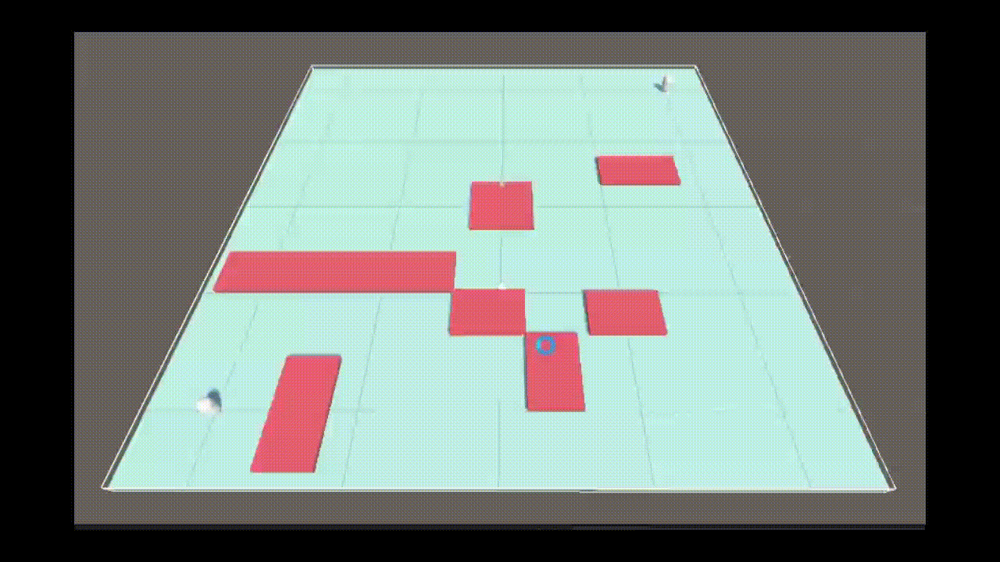

# Pathfinding

## Overview
This repo is an implementation of A* Search and Jump Point Search (JPS) algorithm in C#. 
Both algorithms are optimized with a native heap and demonstrated with Gizmos.

## Visualization
In the following gif, the green nodes and red line connecting them represents the shortest path.
The yellow and azure nodes represents closed and opened nodes respectively.
- A* Search:

- JPS:
